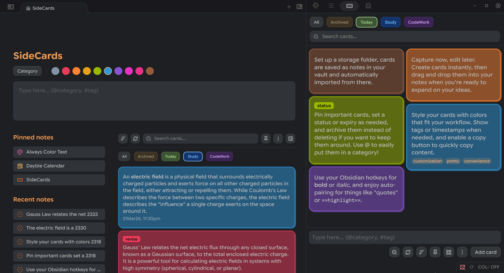
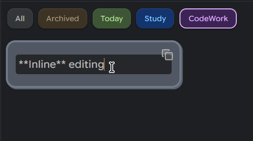
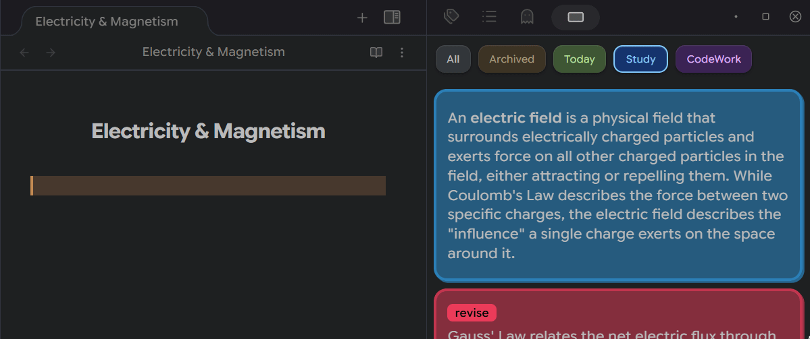
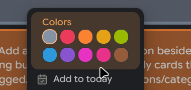
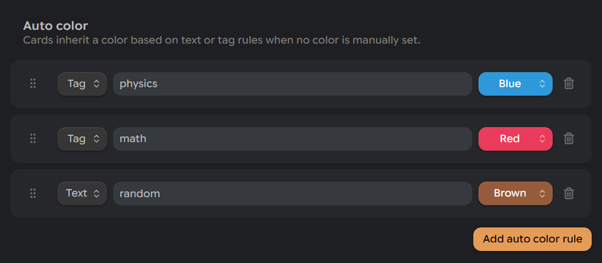
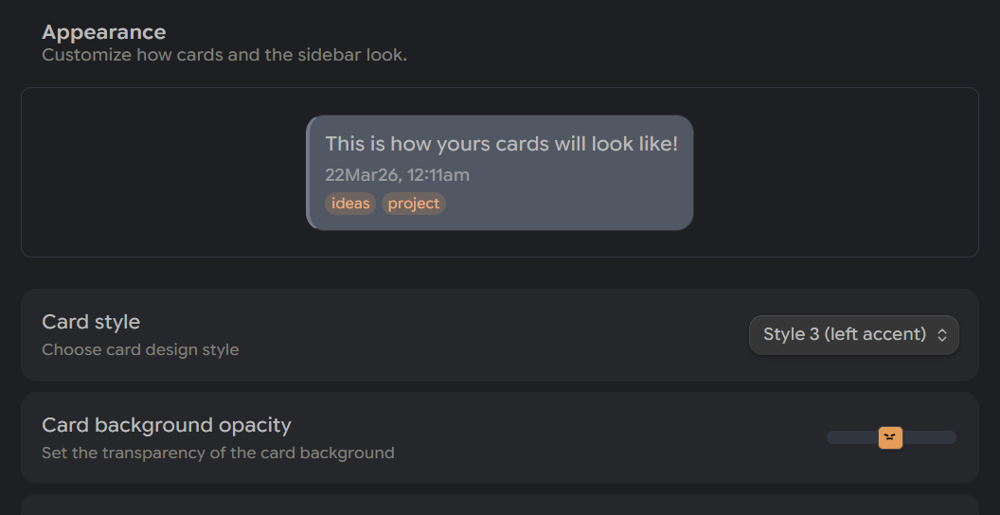
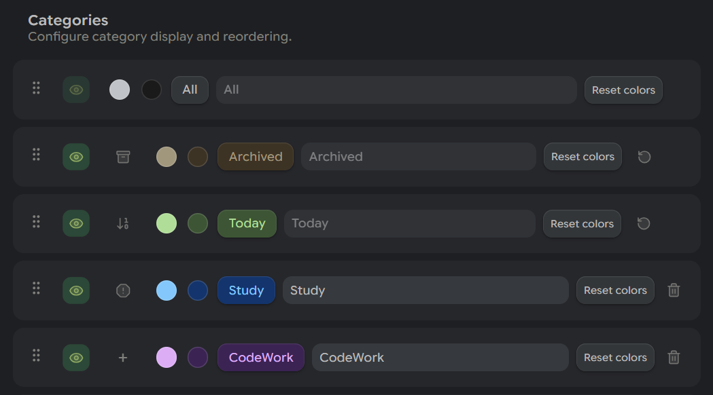
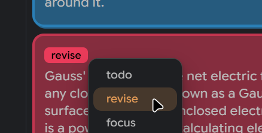
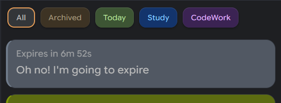
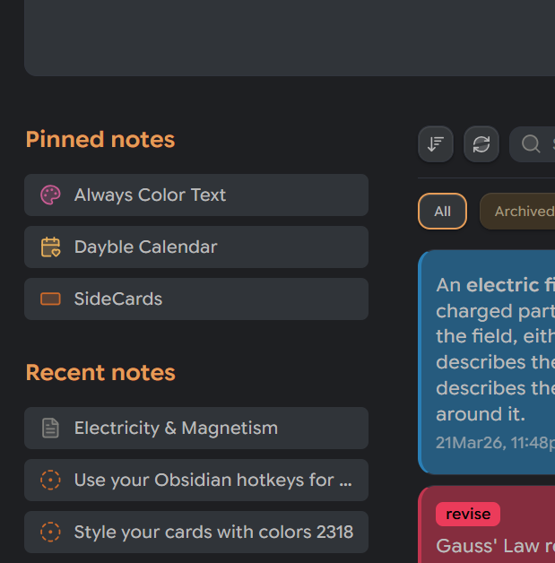

   

# SideCards
Quickly create cards in your Obsidian sidebar; color, tag, and drag them straight into your notes.



<br>

> Create and choose an empty folder in your vault to create new cards from notes instead of importing them!


## Create & Manage Cards Instantly

### Quick Card Creation
Type directly into the sidebar input box to create cards instantly. Cards can also be created from the homepage or via the quick-add command.

### Inline Editing
Edit card content directly: no modals, no interruptions.



### Drag to Editor
Drag any card into your markdown editor to insert its content.



### Essentials
- Real-time Auto-save: Changes are saved automatically as you type.

- Note Conversion: Convert any card to a full markdown note with one click.

- Bidirectional Sync: Changes made in notes automatically update the cards and vice versa.

- Folder Integration: Auto-import markdown files from a specified storage folder.


## Style Your Cards

### 10 Custom Colors
Color-code your cards for visual organization. Enable two row color swatches in two rows for a more compact layout.




### Auto-color Rules
Automatically assign colors based on text content or tag matches.


### Multiple Card Styles
Choose from 3 visual styles and adjust border radius, opacity, and border thickness to customize it to your liking!



## Categories

By default, SideCards includes **Today**, **Tomorrow**, and **Archived** categories.

- **Today** shows cards created or modified today.
- **Tomorrow** is for cards you want to postpone as they’ll automatically move to Today when the day changes.
- **Archived** stores all archived cards.


### Custom Categories
Build your own categories with custom labels, colors, and icons.



Icons currently appear only in the context menu and category list, not on the button itself.

## Card Status System
Assign statuses with custom names, colors, and text colors.



### Color Inheritance
Optionally inherit the status color into the card background.

## Expiry
Set expiry times with optional auto-archive and a time-left pill display.



## Homepage

### Dedicated Homepage View
A full-page view with a card editor, pinned notes, and recent notes.


You can replace your default new tab with this homepage.



Notes can be pinned by right-clicking a tab and selecting “Pin tab to SideCards Homepage,” or by using a command. Icons are supported via the [Iconic plugin](https://github.com/gfxholo/iconic/).


## Other Features

### Auto-pair Brackets
Automatically pairs `(`, `[`, `{`, `` ` ``, `=`, `%`, and `"` while typing.

### Formatting Shortcuts
Bold, italic, highlight, and comment wrapping work inside card editors.


## Installation
You can install it from https://community.obsidian.md/plugins/sidecards.

<!-- 
*SideCards is not yet available in Obsidian Community Plugins or BRAT.*

1. **Clone the repository** and place the plugin folder in your vault’s `.obsidian/plugins/` directory. The folder structure should look like this:

```
sidecards
├─ main.js
├─ styles.css
└─ manifest.json
```

Inside your vault, it should end up like:

```
.your-vault
└─ .obsidian
    └─ plugins
        └─ sidecards
           ├─ main.js
           ├─ styles.css
           └─ manifest.json
```

2. **Enable the plugin** in Obsidian.

3. **Set a storage folder** on first launch. This is where your cards will be saved as notes. -->


### Questions or Suggestions?
Create a new issue [here](https://github.com/Kazi-Aidah/sidecards/issues) to report bugs or request features!